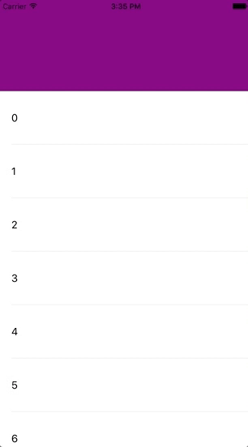

[TOC]

### StretchableHeader

#### 功能介绍
 *    对UIScrollView进行扩展，支持设置stretchableHeader，实现下拉的时候，header放大，类似于qq空间的效果
 *   支持UIScrollView以及它的子类，使用起来非常方便

------------------
####如何使用
* pod "StretchableHeader" 
* 使用代码示例：

``` swift
#pragma mark - UI

- (void)setupUI
{
    self.view.backgroundColor = [UIColor whiteColor];
    
    //add subview
    [self.view addSubview:self.stretchableHeaderTable];
    UIView *header = [[UIView alloc] initWithFrame:CGRectMake(0, 0, [UIScreen mainScreen].bounds.size.width, 150)];
    header.backgroundColor = [UIColor purpleColor];
    self.stretchableHeaderTable.stretchableHeader = header;
    //set frame
}

#pragma mark - Getter && Setter

- (UITableView *)stretchableHeaderTable
{
    if (_stretchableHeaderTable == nil)
    {
        _stretchableHeaderTable = [[UITableView alloc] initWithFrame:CGRectMake(0, 0, [UIScreen mainScreen].bounds.size.width, [UIScreen mainScreen].bounds.size.height) style:UITableViewStyleGrouped];
        _stretchableHeaderTable.dataSource = self;
        _stretchableHeaderTable.delegate = self;
        _stretchableHeaderTable.rowHeight = 88.0f;
    }
    
    return _stretchableHeaderTable;
}

```
#### 效果截图

